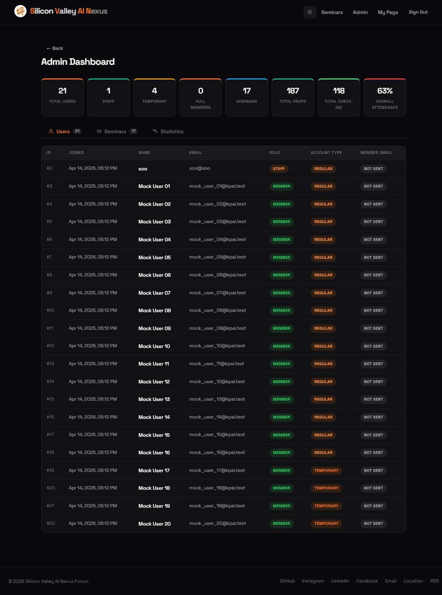
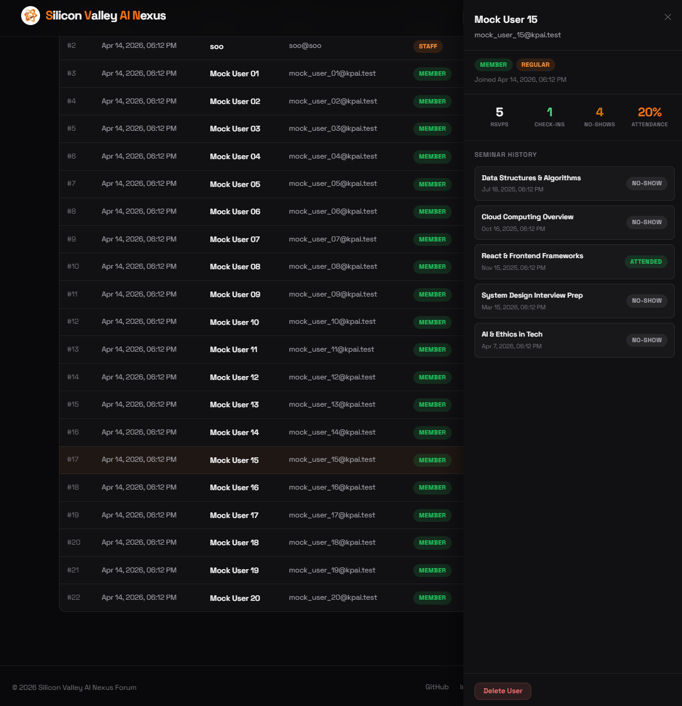
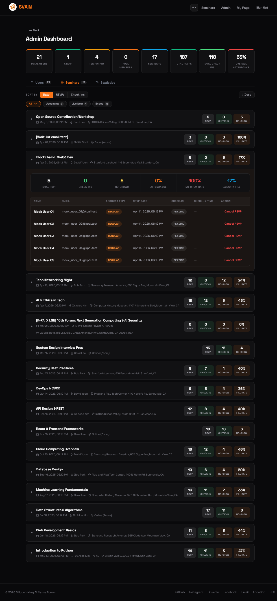
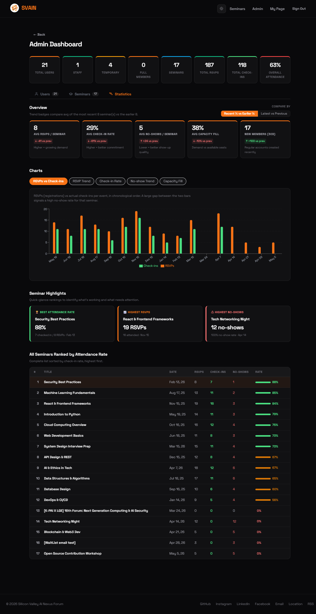

[← Back to Introduction](../Introduction.md)

# Admin Page

> **Staff only.** Access via **Admin** in the top navigation bar.

The Admin Dashboard has three tabs: **Users**, **Seminars**, and **Statistics**.

---

## Users Tab

Displays a full table of all registered accounts with the following columns:

| Column | Description |
|--------|-------------|
| **Name** | Display name |
| **Email** | Account email |
| **Role** | `Staff` or `Member` |
| **Account Type** | `Regular` (has password) or `Temporary` (CSV-imported, no password) |
| **Member Email** | Whether the full-member congratulations email has been sent |

Summary stats at the top show total users, staff count, temporary accounts, and seminars hosted.

### User Detail Panel

Click any row to open a slide-in panel for that user.

The panel shows:

- Role and account type badges
- Join date
- Stats: total RSVPs, check-ins, no-shows, attendance rate
- Full seminar history with per-event status (Attended / No-show)
- **Delete User** button — permanently removes the account (irreversible)

---

## Seminars Tab

Lists all seminars with per-event metrics: total RSVPs, check-ins, no-shows, and attendance rate. Can be filtered by status (All / Upcoming / Live Now / Ended).

---

## Statistics Tab

Platform-wide analytics including:

- **Overview cards** — total members, check-in rate, RSVPs, no-shows, and active seminars
- **Chart** — RSVPs vs. attendance count over time
- **Seminar Highlights** — best attendance rate, most RSVPs, most no-shows
- **Ranked table** — all seminars sorted by attendance rate