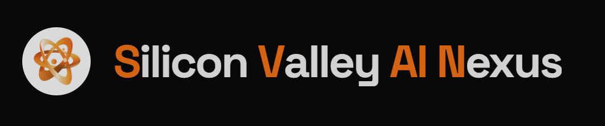
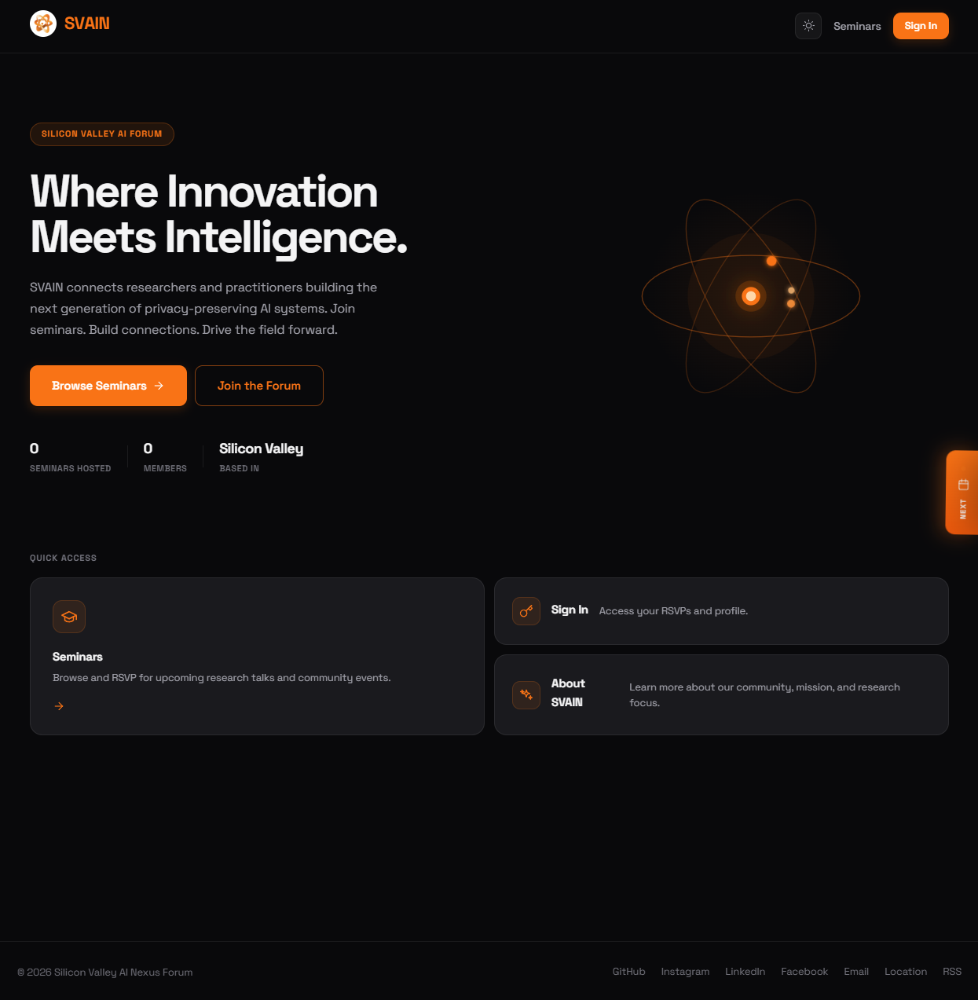
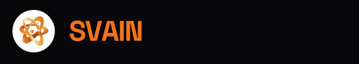
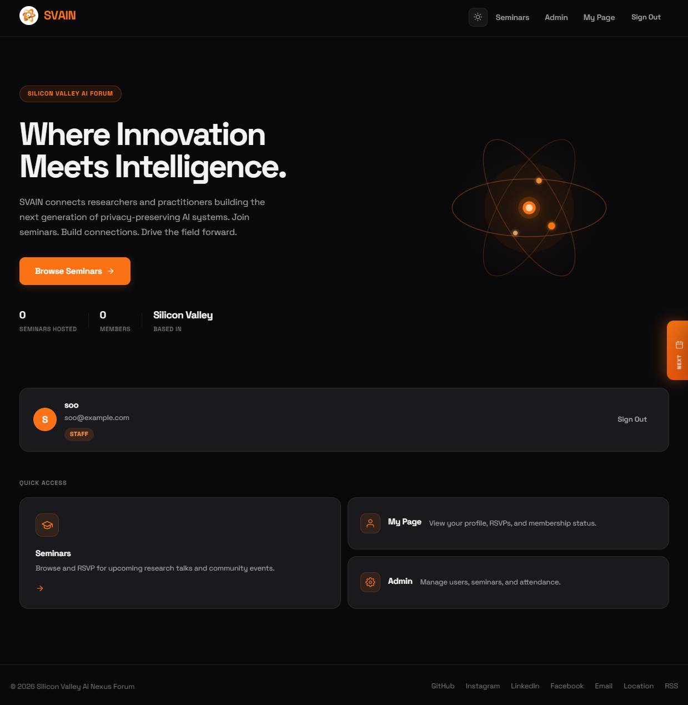
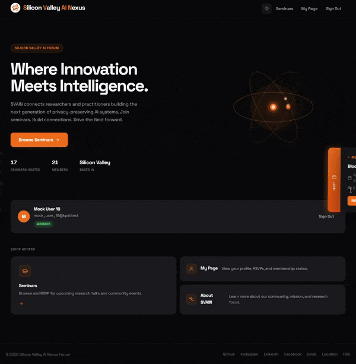
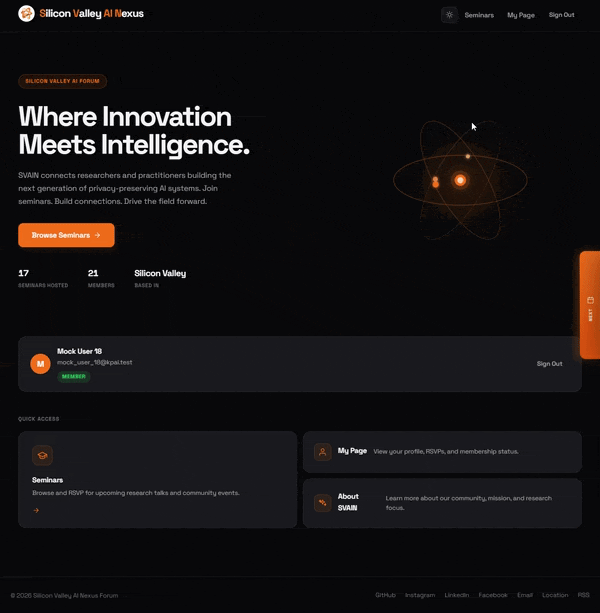
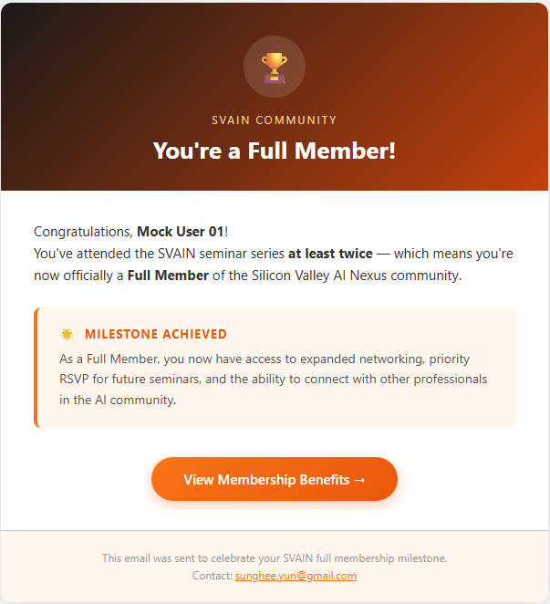

[← Back to Introduction](../Introduction.md)

# General UI

## Logo and Branding

SVAIN (Silicon Valley AI Nexus Forum) uses a dark-themed interface with orange (#F97316) as the primary accent color.

---

## Main Page

### Guest View

When not logged in, the main page displays the hero section with a headline, stats strip, and Quick Access tiles for **Seminars**, **Sign In**, and **About SVAIN**.

The animated orbital logo in the hero section represents the SVAIN brand motion. The page title animates on load.

### Staff View

When signed in as Staff, the header shows **Seminars**, **Admin**, **My Page**, and **Sign Out**. The Quick Access section shows **Seminars**, **My Page**, and **Admin** tiles.

---

## Next Seminar Panel

A floating card is fixed to the right edge of the screen. It shows the nearest upcoming seminar in real time. Hover over it to reveal the full card with the seminar title, date/location, and RSVP button.

---

## Theme Switching

Click the sun/moon icon in the top navigation bar to toggle between **dark mode** and **light mode**. The preference is applied immediately across all pages.

---

## Full Member Email

When a member reaches 2 confirmed check-ins across all seminars, the system automatically sends a congratulatory email.

This email is sent only once per account.
