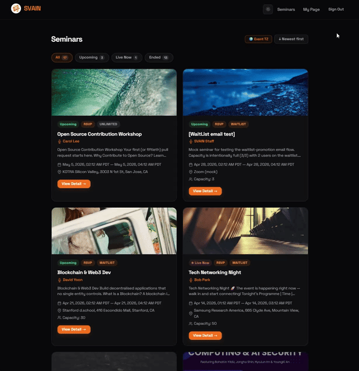
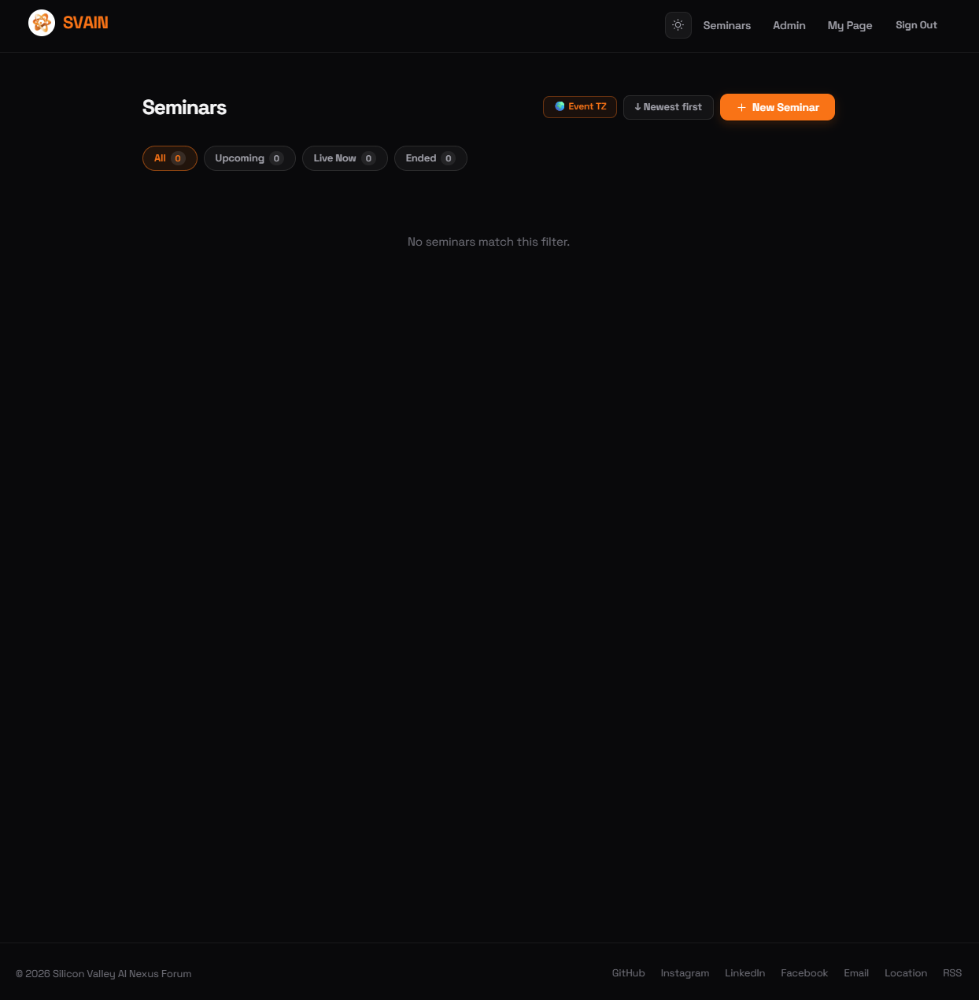
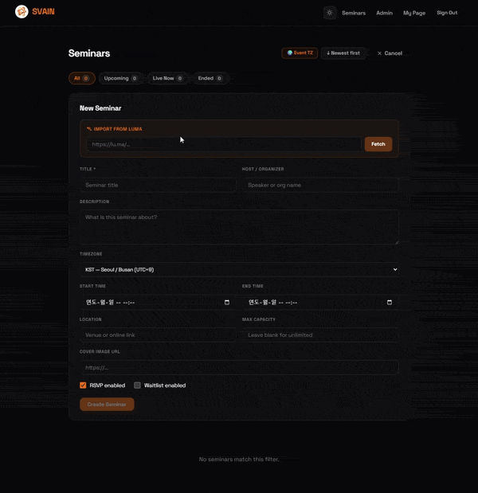
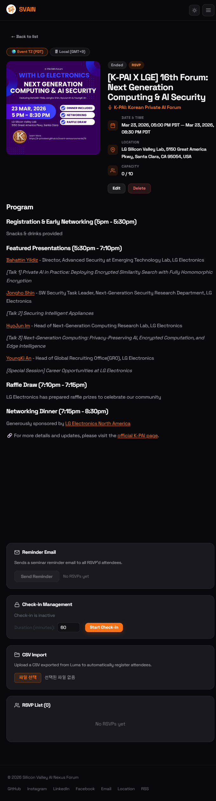
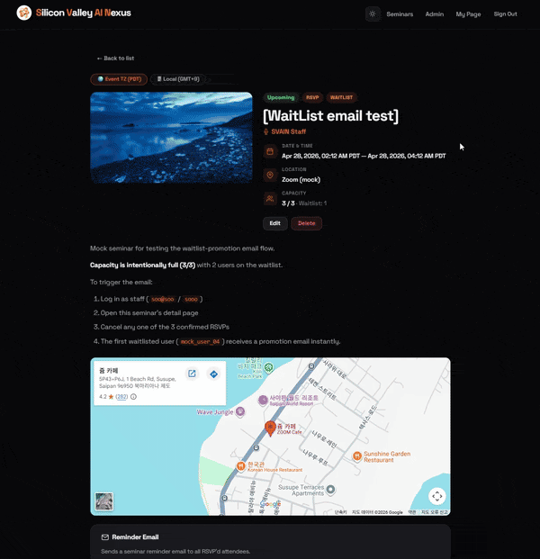
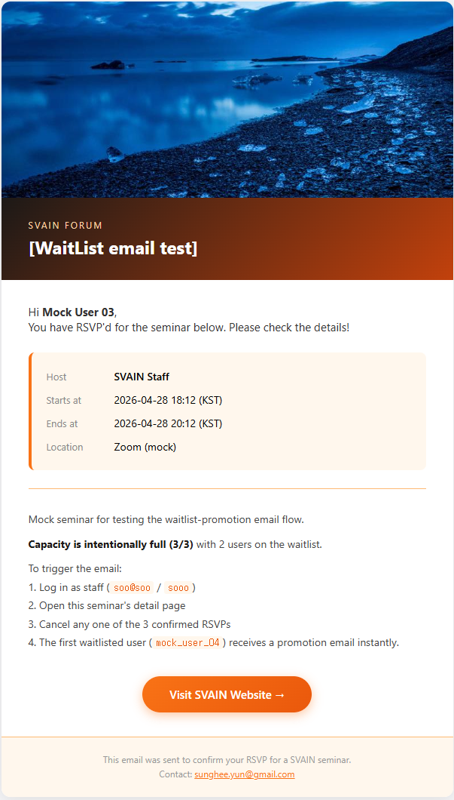
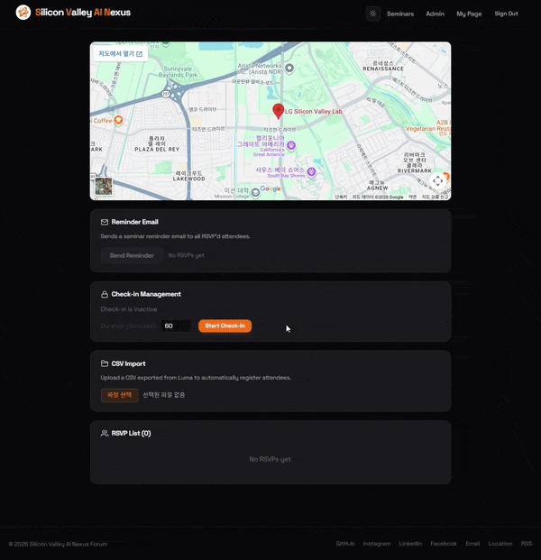
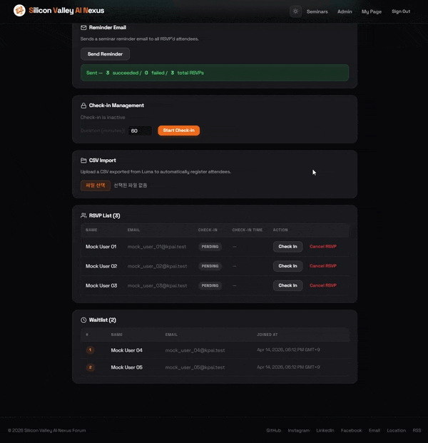
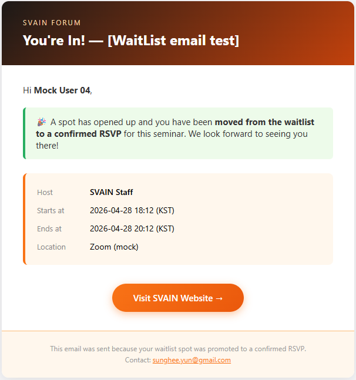
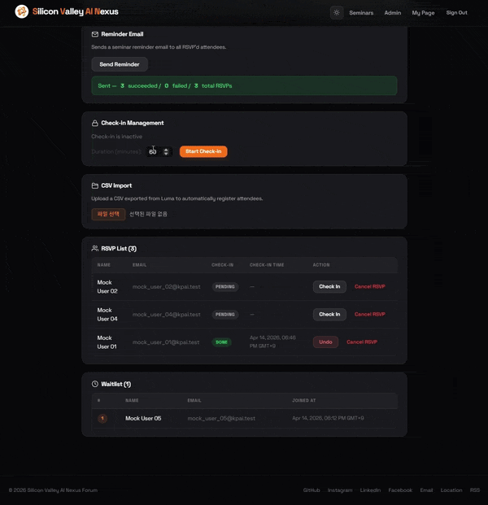

[← Back to Introduction](../Introduction.md)

# Seminar Management

> Staff-only features are marked **(Staff)**. Members can view, RSVP, and check in.

---

## Seminar List

### Display Options

The seminar list supports filtering by status (All / Upcoming / Live Now / Ended), sorting (Newest / Oldest first), and three layout views (List / Card / Table).

### Staff View

Staff see a **+ New Seminar** button and a **Event TZ** toggle to switch displayed times between the event's configured timezone and the browser's local timezone.

---

## Creating a Seminar (Staff)

Click **+ New Seminar** to open the creation form.

### Import from Luma

Paste a Luma event URL and click fetch. SVAIN auto-fills the title, host, location, times, description, and cover image from the Luma page.

Review the imported data and adjust as needed before submitting.

---

## Seminar Detail Page (Staff)

Staff see management panels below the public event content.

---

## Sending a Reminder Email (Staff)

Click **Send Reminder Email** to send a one-time email to all confirmed attendees with the event date, host, and location.

---

## Check-in Management (Staff)

### Starting Check-in

Click **Start Check-in** to generate a QR code token. Attendees scan the code or visit the check-in URL to mark themselves present.

- Staff can also toggle check-in status manually per attendee in the RSVP list.
- Click **Stop Check-in** to invalidate the token immediately.

---

## Waitlist Auto-Promotion

When a confirmed RSVP is cancelled (by staff or the member), the first person on the waitlist is automatically promoted and receives an email.

---

## CSV Import (Staff)

Upload a `.csv` file (e.g., exported from Luma) to bulk-register attendees for a seminar.

**Required column:** `email`

**Optional columns:** `name`, `first_name`, `last_name`, `checked_in_at` (ISO 8601 — marks the RSVP as checked-in)

**Import logic:**
- Existing regular user → matched by email, RSVP created
- Existing temporary user → matched, RSVP created
- Unknown email → a Temporary account is created with no password
- Duplicate → RSVP already exists for this seminar, skipped

If a newly checked-in user now has 2+ total check-ins, a Full Member congratulations email is sent automatically.