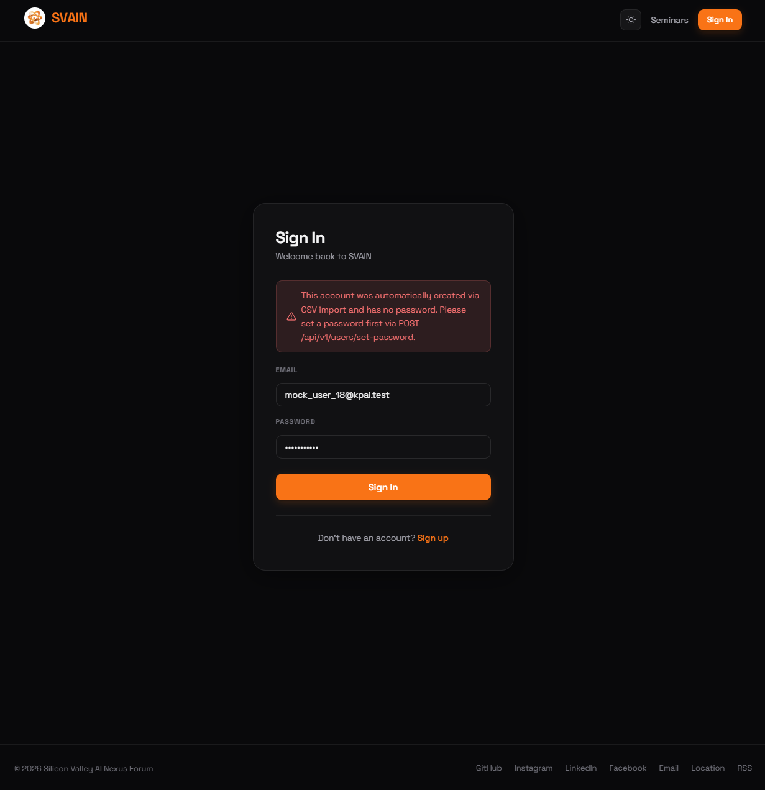
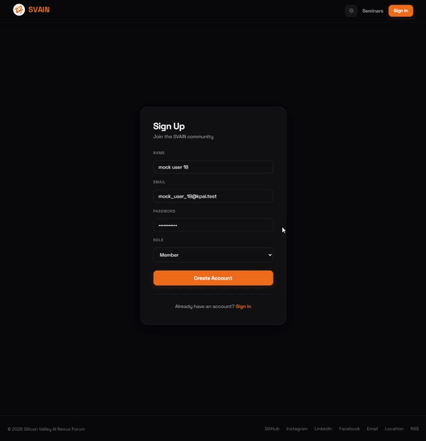

[← Back to Introduction](../../Introduction.md) | [← User Management](../user_management.md)

# CSV-Imported User Flow

When staff imports attendees via CSV, the system creates **Temporary** accounts for emails not already in the database. These accounts have no password.

---

## Signing In with a Temporary Account

If a CSV-imported user tries to sign in, the sign-in page shows an error.

> *"This account was automatically created via CSV import and has no password. Please set a password first via POST /api/v1/users/set-password."*

The user must set a password using the API before they can sign in.

---

## Signing Up with the Same Email

If a CSV-imported user tries to create a new account using their existing email, the sign-up form handles the conflict.

The system detects the existing temporary account and converts it to a full regular account with the submitted password, preserving existing RSVP and check-in history.