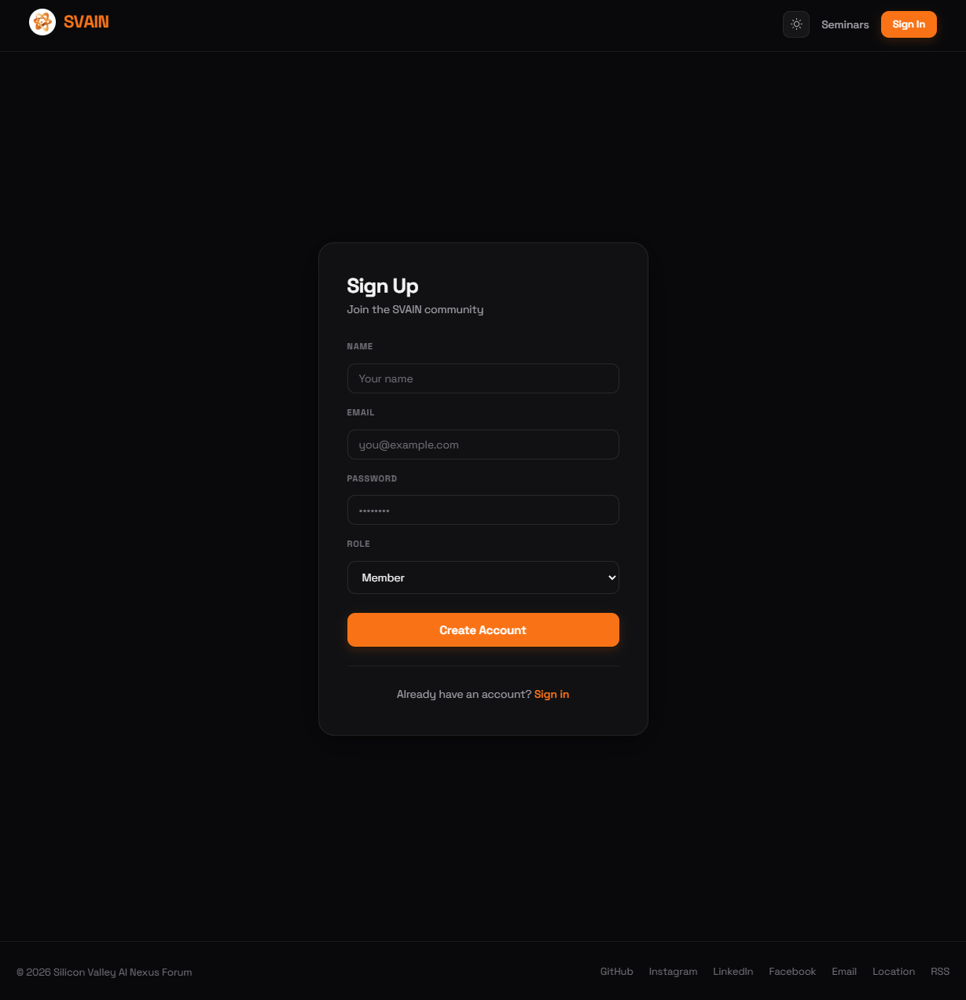
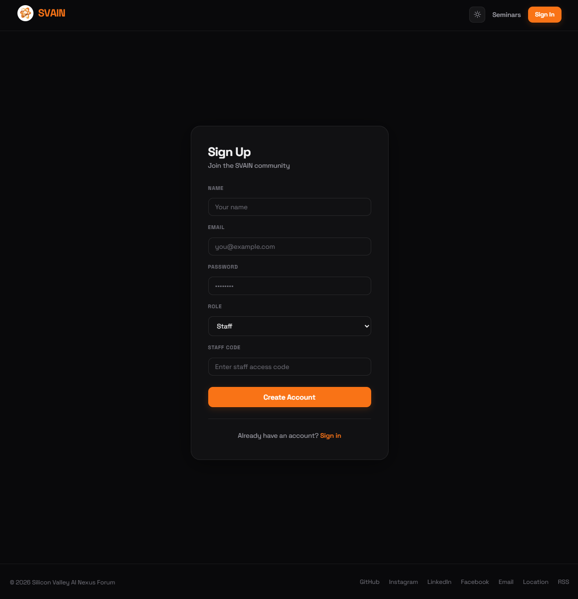
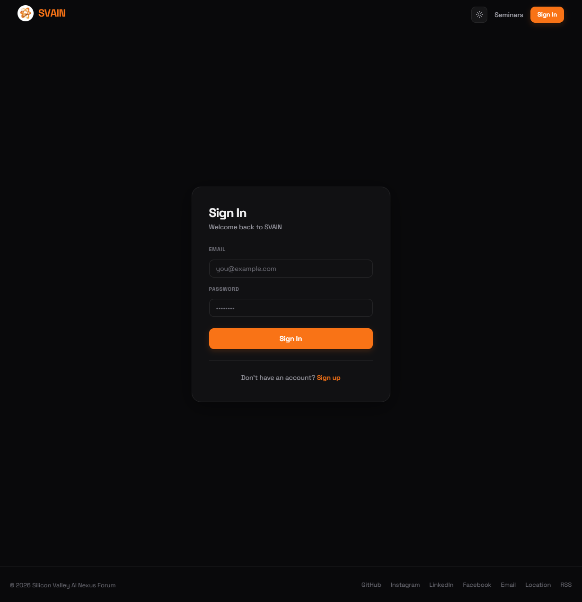
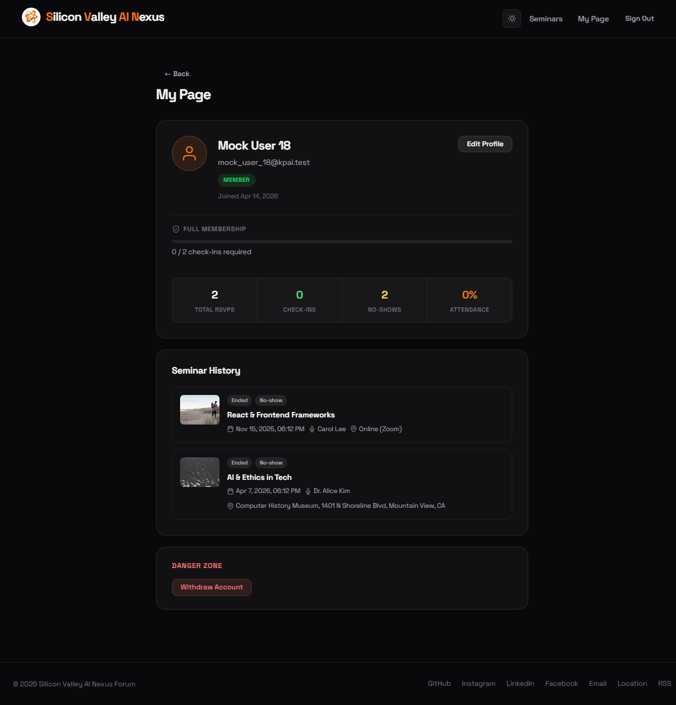

[← Back to Introduction](../Introduction.md)

# User Management

## Sign Up

New users create an account at `/signup`.

### Member Registration

Fill in **Name**, **Email**, **Password**, and set **Role** to **Member**, then click **Create Account**.

### Staff Registration

When **Staff** is selected in the Role dropdown, a **Staff Code** field appears. A valid staff access code is required to create a staff account.

---

## Sign In

Go to `/signin` and enter your **Email** and **Password**, then click **Sign In**.

- On success, the header updates to show the user's navigation options based on their role.
- On failure (wrong credentials), an inline error is displayed.

---

## Auto Sign-out

If a stored session token becomes invalid or expired, the platform automatically signs the user out and redirects to the Sign In page. This prevents silent access with stale credentials.

---

## My Page

Access via **My Page** in the navigation bar (requires sign in).

My Page displays:

- **Profile** — display name, email, role badge, account type (Regular / Temporary), join date
- **Attendance stats** — total RSVPs, check-ins, no-shows, and attendance rate
- **Seminar History** — a list of every seminar the user RSVPed for, with per-event status (Attended / No-show)
- **Edit Profile** button — update display name or email
- **Danger Zone** — account deletion (irreversible)

---

## CSV-Imported Accounts

See [csv_imported_user_edge_case/csv_imported_user_edge_case.md](csv_imported_user_edge_case/csv_imported_user_edge_case.md) for edge cases specific to accounts created via CSV import.